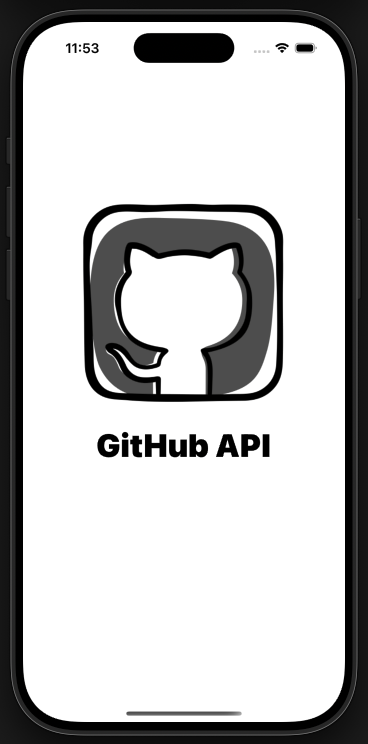
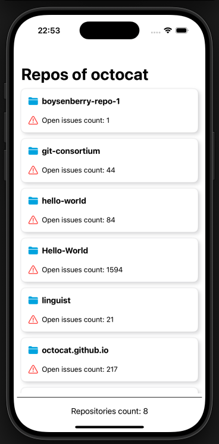
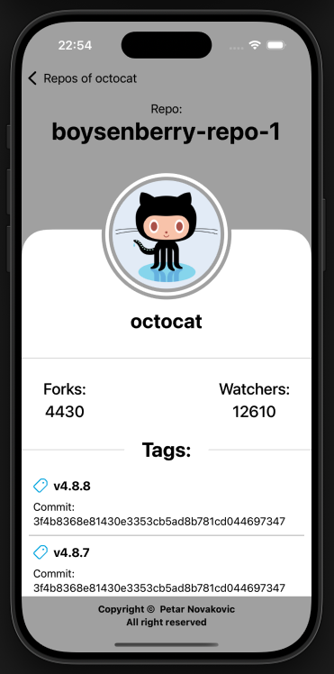
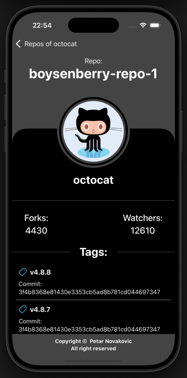

# GitHubAPI
GitHubAPI iOS app covering:

  -  SwiftUI – Declarative UI framework for building modern iOS apps.
  -  MVVM Architecture – Clean separation of concerns between UI and business logic.
  -  Swift Concurrency – Enhancing structured concurrency with async/await.
  -  WebService – Handling network requests with URLSession.
  -  Dependency Injection – Improving testability and modularity.
  -  Mocking – Simulating WebService for testing.
  -  Unit Testing – Ensuring code reliability.
  -  Continuous Integration (CI) – Automating builds and tests.
  -  GitHub Actions – CI/CD pipeline for automatic testing.
  -  Adaptive Appearance – Seamless transition between dark and light modes.
  -  Localization – Supporting multiple languages with Localizable.strings.

📌 Note: No external dependencies – Just download and run.

📸 Screenshots

<table>
  <tr>
    <td></td>
    <td></td>
    <td></td>
    <td></td>
  </tr>
</table>
